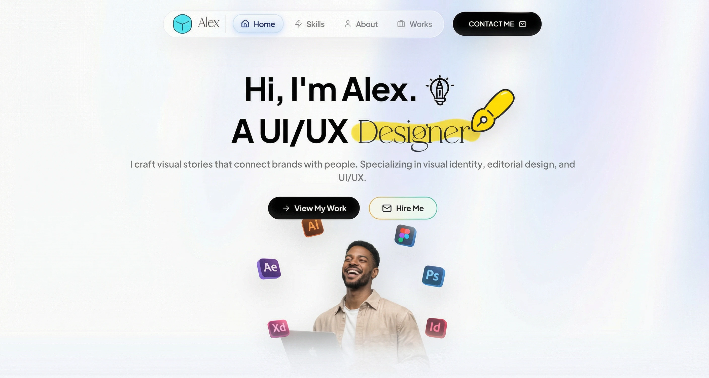

# Alex Portfolio

A dynamic and interactive portfolio website designed for a UI/UX Designer. This project features advanced animations, an aurora background effect, and a clean, modern aesthetic to showcase skills and creative work.

### 💖 Made With Love by Yazioo

## Run Locally

**Prerequisites:** Node.js

1. Install dependencies:
   `npm install`
2. Run the app:
   `npm run dev`

## License

This project is licensed under the [MIT License](LICENSE).

Copyright (c) 2026 Yazioo.
