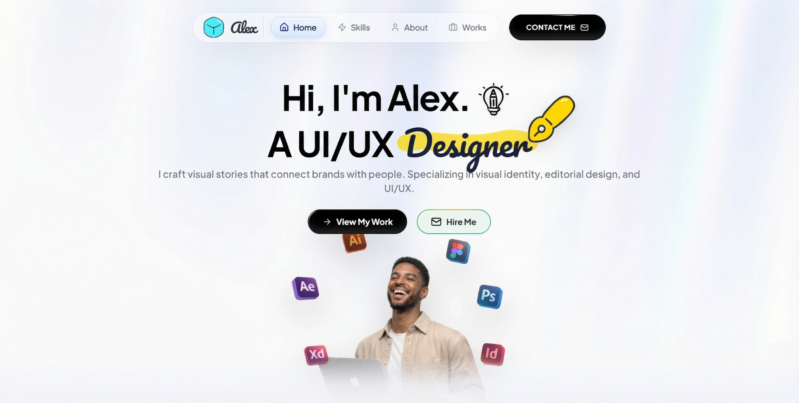

# Alex Portfolio

A dynamic and interactive portfolio website designed for a UI/UX Designer. This project features advanced animations, an aurora background effect, and a clean, modern aesthetic to showcase skills and creative work.

### 💖 Made With Love by Yazioo

## 🌐 Social Media

## Run Locally

**Prerequisites:** Node.js

1. Install dependencies:
   `npm install`
2. Run the app:
   `npm run dev`

## Icon Attributions

**Stickies Color Icons by Streamline** – CC BY 4.0 – https://streamlinehq.com/  
  Licensed under [Creative Commons Attribution 4.0 International (CC BY 4.0)](https://creativecommons.org/licenses/by/4.0/)

## License

This project is licensed under the [MIT License](LICENSE).

Copyright (c) 2026 Yazioo.
